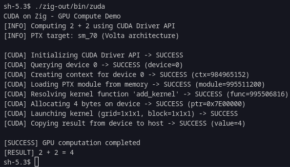
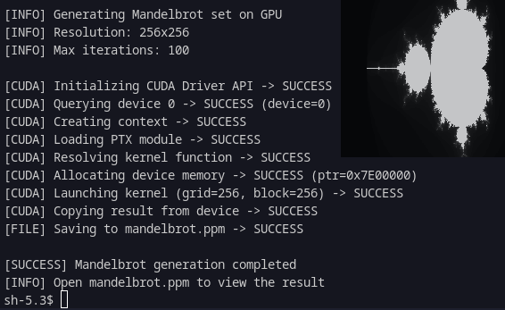

<div align="center">


</div>


## About
zuda is a trying to run cuda on zig

## Fast Start

```bash
# build
make build

# run
./zig-out/bin/zuda 
```

<p align="center">
  
   
</p>

<div align="center">

---

### Contact

Telegram: [zarazaex](https://t.me/zarazaexe)
<br>
Email: [zarazaex@tuta.io](mailto:zarazaex@tuta.io)
<br>
Site: [zarazaex.xyz](https://zarazaex.xyz)
<br>
